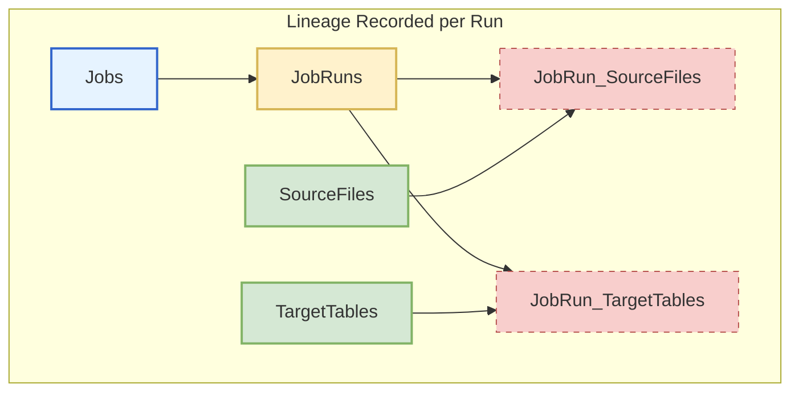
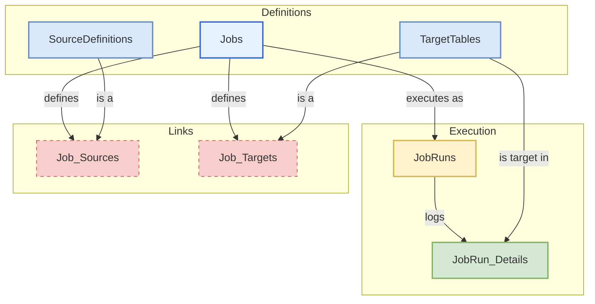

# Relational Database Schema for Data Lineage

This document outlines two proposed database schemas for tracking data lineage from data loading jobs. The primary goal is to create a clear, queryable record of which source files contribute data to which database tables.

We present two models:

1. **Lineage Aligned to Job Runs**: A flexible model where lineage is recorded for each specific execution of a job. This is ideal for dynamic jobs where the source files or target tables might change between runs.
2. **Lineage Aligned to Job Definitions**: A stricter model where a job has a pre-defined "contract" of sources and targets. Each job run is an instance of this contract. This is better for standardized, operational jobs.

---

## Model 1: Lineage Aligned to Job Runs

In this model, the **`JobRuns`** table is the central hub connecting the specific files processed to the specific tables loaded during that single execution.

### Schema Diagram



### Table Definitions

**Jobs**

* `JobID` (PK, INT): Unique identifier for the job definition.
* `JobName` (VARCHAR): A human-readable name (e.g., LoadDailySales).
* `JobDescription` (TEXT): A brief description of the job's purpose.
* `CreatedAt` (TIMESTAMP): Timestamp of when the job definition was created.

**JobRuns**

* `JobRunID` (PK, INT): Unique identifier for this specific run.
* `JobID` (FK, INT): Links to the job that was run.
* `StartTime` (TIMESTAMP): When the run began.
* `EndTime` (TIMESTAMP): When the run completed.
* `Status` (VARCHAR): The outcome of the run (e.g., SUCCESS, FAILURE, IN\_PROGRESS).
* `RowsProcessed` (INT): Total number of rows handled during the run.

**SourceFiles**

* `FileID` (PK, INT): Unique identifier for the file record.
* `FileName` (VARCHAR): The name of the file (e.g., sales\_20250731.csv).
* `FilePath` (VARCHAR): The full path or URI of the file (e.g., s3://my-bucket/raw/).
* `FileHash` (VARCHAR): A hash (e.g., MD5, SHA256) of the file content to track changes.
* `FirstSeenAt` (TIMESTAMP): When this file was first logged.

**TargetTables**

* `TableID` (PK, INT): Unique identifier for the table record.
* `SchemaName` (VARCHAR): The database schema name.
* `TableName` (VARCHAR): The database table name.

**JobRun\_SourceFiles (Junction Table)**

* `JobRunID` (FK, INT): Foreign Key to JobRuns.
* `FileID` (FK, INT): Foreign Key to SourceFiles.
* (Composite Primary Key on `JobRunID`, `FileID`)

**JobRun\_TargetTables (Junction Table)**

* `JobRunID` (FK, INT): Foreign Key to JobRuns.
* `TableID` (FK, INT): Foreign Key to TargetTables.
* `RowsInserted` (INT): Number of rows inserted into this table during this run.
* `RowsUpdated` (INT): Number of rows updated in this table during this run.
* (Composite Primary Key on `JobRunID`, `TableID`)

### Example Queries

**Find all files that loaded the FactSales table:**

```sql
SELECT
    sf.FileName,
    sf.FilePath,
    jr.StartTime
FROM SourceFiles sf
JOIN JobRun_SourceFiles jrsf ON sf.FileID = jrsf.FileID
JOIN JobRuns jr ON jrsf.JobRunID = jr.JobRunID
JOIN JobRun_TargetTables jrtt ON jr.JobRunID = jrtt.JobRunID
JOIN TargetTables tt ON jrtt.TableID = tt.TableID
WHERE tt.TableName = 'FactSales' AND tt.SchemaName = 'dbo';
```

**Find which tables were affected by a specific file (archive.zip):**

```sql
SELECT
    tt.SchemaName,
    tt.TableName,
    jr.StartTime
FROM TargetTables tt
JOIN JobRun_TargetTables jrtt ON tt.TableID = jrtt.TableID
JOIN JobRuns jr ON jrtt.JobRunID = jr.JobRunID
JOIN JobRun_SourceFiles jrsf ON jr.JobRunID = jrsf.JobRunID
JOIN SourceFiles sf ON jrsf.FileID = sf.FileID
WHERE sf.FileName = 'archive.zip';
```

---

## Model 2: Lineage Aligned to Job Definitions

This model defines a job's "contract" upfront. The lineage is static at the job level, and each run logs the specific files and row counts as an instance of that contract.

### Schema Diagram



### Table Definitions

**Jobs** (Unchanged from Model 1)

* `JobID` (PK, INT)
* `JobName` (VARCHAR)
* `JobDescription` (TEXT)
* `CreatedAt` (TIMESTAMP)

**SourceDefinitions**

* `SourceID` (PK, INT): Unique identifier for the source definition.
* `SourceName` (VARCHAR): A logical name (e.g., Daily Sales CSVs).
* `SourcePathPattern` (VARCHAR): The pattern to find files (e.g., s3://my-bucket/sales\_\*.csv).
* `Description` (TEXT)

**TargetTables** (Unchanged from Model 1)

* `TableID` (PK, INT)
* `SchemaName` (VARCHAR)
* `TableName` (VARCHAR)

**Job\_Sources (Junction Table)**

* `JobID` (FK, INT): Foreign Key to Jobs.
* `SourceID` (FK, INT): Foreign Key to SourceDefinitions.
* (Composite Primary Key on `JobID`, `SourceID`)

**Job\_Targets (Junction Table)**

* `JobID` (FK, INT): Foreign Key to Jobs.
* `TableID` (FK, INT): Foreign Key to TargetTables.
* (Composite Primary Key on `JobID`, `TableID`)

**JobRuns**

* `JobRunID` (PK, INT): Unique identifier for this specific run.
* `JobID` (FK, INT): Links the run to its definition.
* `StartTime` (TIMESTAMP)
* `EndTime` (TIMESTAMP)
* `Status` (VARCHAR)

**JobRun\_Details**

* `JobRunDetailID` (PK, INT): Unique identifier for this log entry.
* `JobRunID` (FK, INT): Foreign Key to JobRuns.
* `ActualSourcePath` (VARCHAR): The concrete file path processed (e.g., s3://my-bucket/sales\_20250731.csv).
* `TargetTableID` (FK, INT): Foreign Key to TargetTables.
* `RowsInserted` (INT)
* `RowsUpdated` (INT)

### Example Queries

**What are the defined sources and targets for the LoadDailySales job?**

```sql
SELECT
    j.JobName,
    sd.SourcePathPattern,
    tt.SchemaName,
    tt.TableName
FROM Jobs j
LEFT JOIN Job_Sources js ON j.JobID = js.JobID
LEFT JOIN SourceDefinitions sd ON js.SourceID = sd.SourceID
LEFT JOIN Job_Targets jt ON j.JobID = jt.JobID
LEFT JOIN TargetTables tt ON jt.TableID = tt.TableID
WHERE j.JobName = 'LoadDailySales';
```

**For the last successful run, which specific files were processed and which tables were loaded?**

```sql
SELECT
    jr.StartTime,
    jrd.ActualSourcePath,
    tt.TableName,
    jrd.RowsInserted
FROM JobRuns jr
JOIN Jobs j ON jr.JobID = j.JobID
JOIN JobRun_Details jrd ON jr.JobRunID = jrd.JobRunID
JOIN TargetTables tt ON jrd.TargetTableID = tt.TableID
WHERE j.JobName = 'LoadDailySales'
  AND jr.Status = 'SUCCESS'
ORDER BY jr.StartTime DESC;
```
